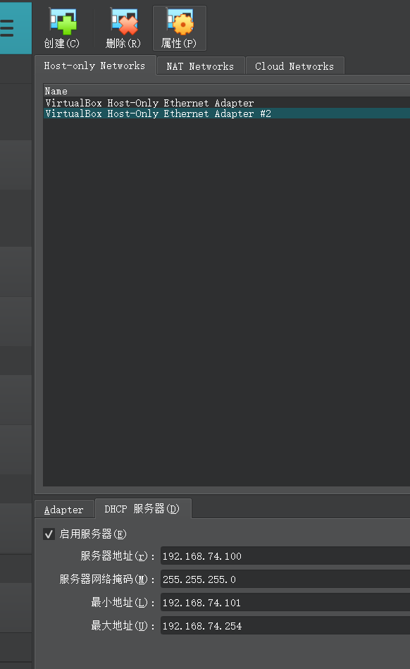

# 基于 VirtualBox 的网络攻防基础环境搭建

## 实验目的

* 掌握 VirtualBox 虚拟机的安装与使用；
* 掌握 VirtualBox 的虚拟网络类型和按需配置；
* 掌握 VirtualBox 的虚拟硬盘多重加载；

## 实验环境

以下是本次实验需要使用的网络节点说明和主要软件举例：

* VirtualBox 虚拟机
* 攻击者主机（Attacker）：Kali-linux-2023.3-virtalbox-amd64
* 网关（Gateway, GW）：Debian Buster
* 靶机（Victim）：From Sqli to shell / xp-sp3 / Kali

## 实验要求

* [x] 虚拟硬盘配置成多重加载，效果如下图所示；


* [x] 搭建满足如下拓扑图所示的虚拟机网络拓扑；


> 根据实验宿主机的性能条件，可以适度精简靶机数量

* 完成以下网络连通性测试；
    - [x] 靶机可以直接访问攻击者主机
    - [x] 攻击者主机无法直接访问靶机
    - [x] 网关可以直接访问攻击者主机和靶机
    - [x] 靶机的所有对外上下行流量必须经过网关
    - [x] 所有节点均可以访问互联网

## 实验过程

###  配置虚拟机与虚拟硬盘
1. 从[中传云盘](https://kod.cuc.edu.cn/#s/8d01XBZA?passwor2ed=nG8qk)下载黄老师的.vdi文件，并解压到本地目录

2. 在VirtualBox中注册三个虚拟硬盘


3. 创建虚拟机：
创建虚拟机，选择`Use an Existing Virtual Hard Disk File`


4. 设置`多重加载`
如果直接在`虚拟硬盘`界面设置`多重加载`，会出现报错显示版本过低，如图:


解决方法：先进行`步骤3.`，点开运行虚拟机后退出，再进行`步骤4.`，即可成功设置`多重加载`。
这个方法是偶然间发现的，个人猜测原因是启动虚拟机后，VirtualBox会自动更新虚拟机的版本，从而解决了版本过低的问题。

5. 重复`步骤3.`和`步骤4.`，创建6个虚拟机，分别命名为`Attacker-kali`、`Gateway-Debian`、`Victim-XP-1`、`Victim-XP-2`、`Victim-Kali-1`、`Victim-Debian-2`，并设置虚拟硬盘为`多重加载`，简单分了个组，如图：


### 配置虚拟机网络、搭建网络拓扑
#### 创建`Host-Only`网络
创建网卡`VirtualBox Host-Only Ethernet Adapter #2`
配置地址为`192.168.74.1` 子网掩码为`255.255.255.0`
启用DHCP服务器，配置服务器地址为`192.168.74.100` 子网掩码为`255.255.255.0`
地址范围为`192.168.74.101~254`



#### 配置虚拟机及网络
1. Gateway-Debian
    - 网卡1：`NAT网络地址转换`
        ip:10.0.2.15/24
    - 网卡2：`仅主机(Host-Only)网络`
        选择`VirtualBox Host-Only Ethernet Adapter #2`
        ip:192.168.74.101/24
    - 网卡3：`内部网络(InternalNetwork)`
        命名为`InternalNetwork1`
        ip:172.16.111.1/24
    - 网卡4：`内部网络(InternalNetwork)`
        命名为`InternalNetwork2`
        ip:172.16.222.1/24


开机后发现需要输入账号密码，浏览网络及尝试后得知，Debian的root账号密码为:
- 账号： `root`
- 密码： `toor`
重置了`cuc`账户的密码为`cuc`，方便使用。
检查网卡配置文件发现老师给的镜像中网卡配置已经配置好了。

- 突然意识到还有5个虚拟机，重新改了一下`hostname`为`lihanGatewayDebian`

2. Victim-XP-1/2
以`Victim-XP-1`为例，另一个同理。
    - 网卡1：`内部网络(InternalNetwork)`
        命名为`InternalNetwork1`
        ip:172.16.111.112
        网关:172.16.111.1

开机验证：


`Victim-XP-2`
    - 网卡1：`内部网络(InternalNetwork)`
        命名为`InternalNetwork2`
        ip:172.16.222.114
        网关:172.16.222.1

3. Victim-kali-1
开机后发现需要输入账号密码，浏览网络及尝试后得知，Debian的root账号密码为:
- 账号： `kali`
- 密码： `kali`
    - 网卡1：`内部网络(InternalNetwork)`
        命名为`InternalNetwork1`
        ip:172.16.111.102
        网关:172.16.111.1

开机验证：


4. Victim-Debian-2
    - 网卡1：`内部网络(InternalNetwork)`
        命名为`InternalNetwork2`
        ip:172.16.222.143
        网关:172.16.222.1

开机验证：


5. Attacker-kali
创建NAT网络,并修改Gateway-Debian的网卡1为NAT网络:


    - 网卡1：`NAT网络`
        ip: 10.0.2.4


开机验证：


#### 进行尚未进行过的网络连通性验证

1. 靶机-攻击机
    - 靶机可以直接访问攻击者主机
    - 攻击者主机无法直接访问靶机


2. 靶机的所有对外上下行流量必须经过网关


### 总览


### 实验问题

1. 修改Debian的主机名后，使用`sudo`命令时会出现如下报错：
```bash
sudo: unable to resolve host lihanDebian: No address associated with hostname
```


应该是修改了主机名后一些程序调用的仍然是原来的主机名，好在不影响使用，但总卡几秒钟并且需要重复输入密码很烦人。

`解决方法`：
```bash
 sudo vim /etc/hosts
```


## 参考
- [VirtualBox虚拟机几种网络的区别](https://lihan3238.github.io/p/virtualnetwork/)
- [Debian 修改主机名的方法](https://www.xxapp.net/12209.html)
- [Ubuntu / Debian: sudo 出现 unable to resolve host 错误解决办法](https://www.bilibili.com/read/cv20438982/)
- [linux虚拟机安装与配置/ssh免密登录](https://lihan3238.github.io/p/linuxstudy/#ssh%E5%85%8D%E5%AF%86%E7%99%BB%E5%BD%95)
- [黄老师的畅课视频回放](http://courses.cuc.edu.cn/course/111120/learning-activity/full-screen#/561690)

