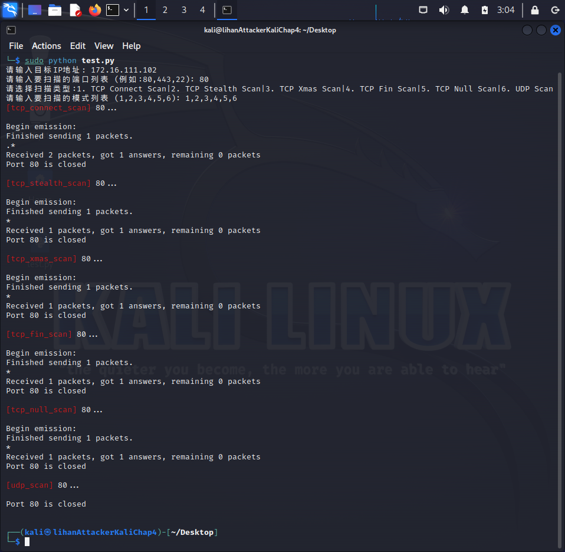
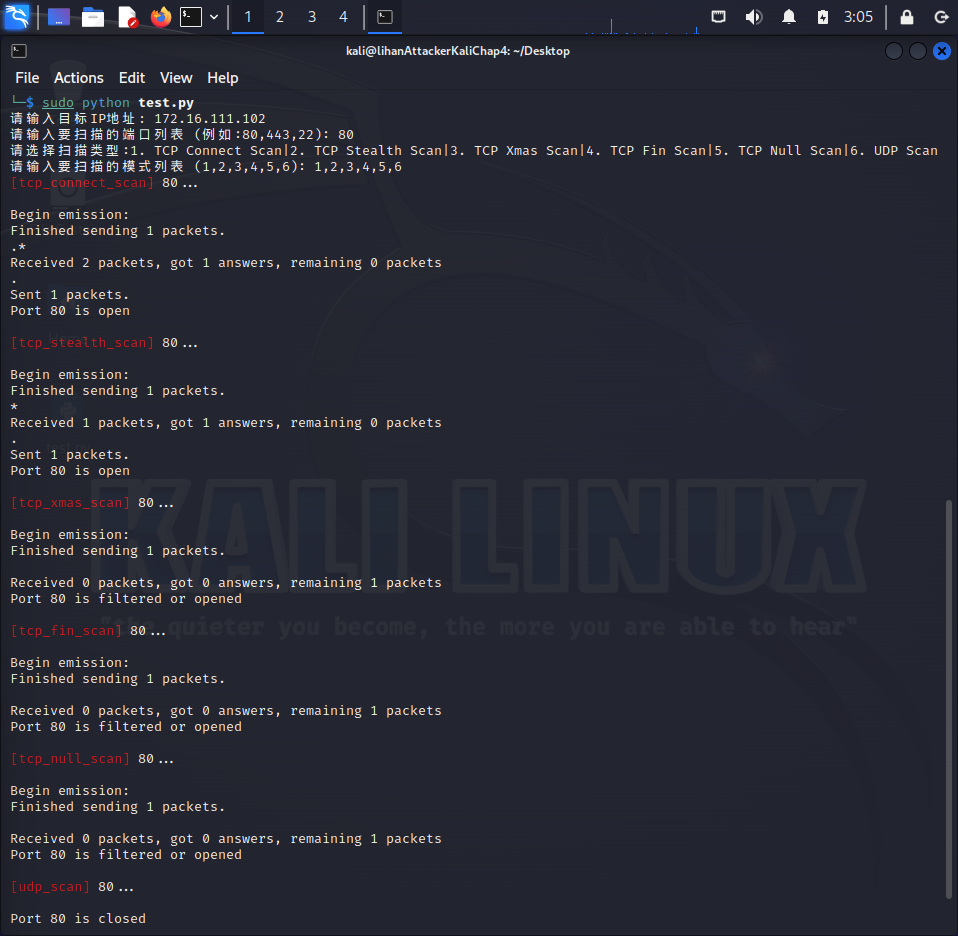
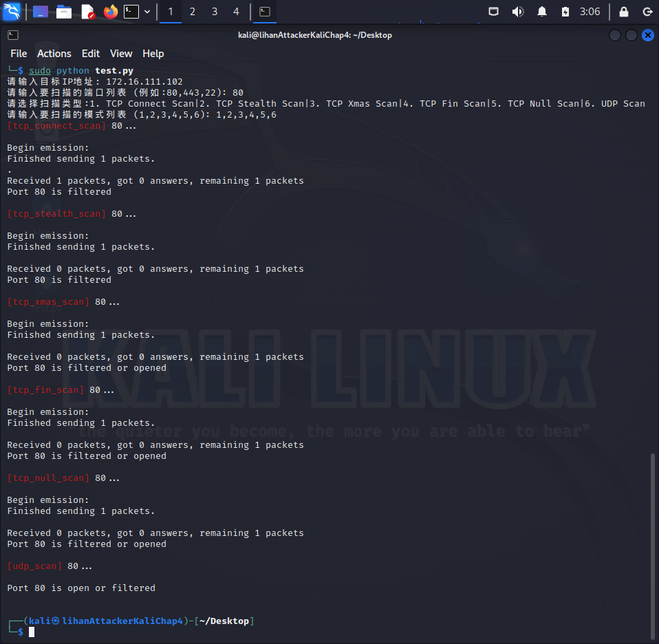

# 基于 Scapy 编写端口扫描器

## 实验目的

- 掌握网络扫描之端口状态探测的基本原理

## 实验环境

- kali 
- python 3.11.4
- scapy 2.5.0

## 实验要求

- [x] 禁止探测互联网上的 IP ，严格遵守网络安全相关法律法规
- [x] 完成以下扫描技术的编程实现
- - TCP connect scan / TCP stealth scan
- - TCP Xmas scan / TCP fin scan / TCP null scan
- - UDP scan
- [x] 上述每种扫描技术的实现测试均需要测试端口状态为：开放、关闭 和 过滤 状态时的程序执行结果
- [x] 提供每一次扫描测试的抓包结果并分析与课本中的扫描方法原理是否相符？如果不同，试分析原因；
- [x] 在实验报告中详细说明实验网络环境拓扑、被测试 IP 的端口状态是如何模拟的

## 实验内容

### 实验网络环境拓扑


### 如图所示网络中的节点基本信息如下：
- 攻击者主机(lihanAttackerKaliChap4)
- - mac地址：08:00:27:ef:46:19/eth0
- - ip地址：172.16.111.135
- 受害者主机(lihanVictimKali1)
- - mac地址：08:00:27:93:2e:67/eth0
- - ip地址：172.16.111.102
- 网关(lihanGatewayDebian)
- - mac地址：08:00:27:63:cd:72/enp0s9
- - ip地址：172.16.111.1


### 实验过程

#### 扫描技术的编程实现

 测试端口状态为：开放、关闭 和 过滤 状态时的程序执行结果

- **关闭状态**：对应端口没有开启监听, 防火墙没有开启。
  ```bash
  ufw disable
  ```
- **开启状态**：对应端口开启监听: apache2基于TCP, 在80端口提供服务;防火墙ufw处于关闭状态。
  ```bash
  systemctl start apache2 # port 80
  ```
- **过滤状态**：对应端口开启监听, 防火墙开启。
  ```bash
  ufw enable && ufw deny 80/tcp
  ```


##### TCP connect scan / TCP stealth scan

- TCP connect scan

这种扫描方式可以使用 Connect()调用，使用最基本的 TCP 三次握手链接建立机制，建立一个链接到目标主机的特定端口上。
首先发送一个 SYN 数据包到目标主机的特定端口上，接着我们可以通过接收包的情况对端口的状态进行判断：

如果接收到的是一个 SYN/ACK 数据包，则说明端口是开放状态的；
如果接收到的是一个 RST/ACK 数据包，通常意味着端口是关闭的并且链接将会被重置；
如果目标主机没有任何响应则意味着目标主机的端口处于过滤状态。

若接收到 SYN/ACK 数据包（即检测到端口是开启的），便发送一个 ACK 确认包到目标主机，这样便完成了三次握手连接机制。成功后再终止连接。如图所示：


```python
def tcp_connect_scan(target_ip, target_port):
    print(f"\033[31m[tcp_connect_scan]\033[0m {target_port}...\n")
    response = sr1(IP(dst=target_ip)/TCP(dport=target_port, flags="S"), timeout=2)
    if response and response.haslayer(TCP):
        if response[TCP].flags == 0x12:
            send(IP(dst=target_ip)/TCP(dport=target_port, flags="R"))
            print(f"Port {target_port} is open\n")
        elif response[TCP].flags == 0x14:
            print(f"Port {target_port} is closed\n")
    else:
        print(f"Port {target_port} is filtered\n")
```

- TCP stealth scan

在`TCP connect scan`基础上，收到目标主机的数据包后，不进行回应，从而不打成三次握手连接，这使得目标主机难以确定是否正在进行扫描。

```python
def tcp_stealth_scan(target_ip, target_port):
    print(f"\033[31m[tcp_stealth_scan]\033[0m {target_port}...\n")
    response = sr1(IP(dst=target_ip)/TCP(dport=target_port, flags="S"), timeout=2)
    if response and response.haslayer(TCP):
        if response[TCP].flags == 0x12:
            send(IP(dst=target_ip)/TCP(dport=target_port, flags="R"))
            print(f"Port {target_port} is open\n")
        elif response[TCP].flags == 0x14:
            print(f"Port {target_port} is closed\n")
    else:
        print(f"Port {target_port} is filtered\n")
```


##### TCP Xmas scan / TCP fin scan / TCP null scan

- TCP Xmas scan

Xmas 发送一个 TCP 包，并对 TCP 报文头 FIN、URG 和 PUSH 标记进行设置。若是关闭的端口则响应 RST 报文；开放或过滤状态下的端口则无任何响应。如图所示。优点是隐蔽性好，缺点是需要自己构造数据包，要求拥有超级用户或者授权用户权限。


```python
def tcp_xmas_scan(target_ip, target_port):
    print(f"\033[31m[tcp_xmas_scan]\033[0m {target_port}...\n")
    response = sr1(IP(dst=target_ip)/TCP(dport=target_port, flags="FPU"), timeout=2)
    if response and response.haslayer(TCP):
        if response[TCP].flags == 0x14:
            print(f"Port {target_port} is closed\n")
    else:
        print(f"Port {target_port} is filtered or opened\n")
```

- TCP fin scan

仅发送 FIN 包，它可以直接通过防火墙，如果端口是关闭的就会回复一个 RST 包，如果端口是开放或过滤状态则对 FIN 包没有任何响应。如图所示。
其优点是 FIN 数据包能够通过只监测 SYN 包的包过滤器，且隐蔽性高于 SYN 扫描。缺点和 SYN 扫描类似，需要自己构造数据包，要求由超级用户或者授权用户访问专门的系统调用。


```python
def tcp_fin_scan(target_ip, target_port):
    print(f"\033[31m[tcp_fin_scan]\033[0m {target_port}...\n")
    response = sr1(IP(dst=target_ip)/TCP(dport=target_port, flags="F"), timeout=2)
    if response and response.haslayer(TCP):
        if response[TCP].flags == 0x14:
            print(f"Port {target_port} is closed\n")
    else:
        print(f"Port {target_port} is filtered or opened\n")
```

- TCP null scan

发送一个 TCP 数据包，关闭所有 TCP 报文头标记。只有关闭的端口会发送 RST 响应。其优点和 Xmas 一样是隐蔽性好，缺点也是需要自己构造数据包，要求拥有超级用户或者授权用户权限。


```python
def tcp_null_scan(target_ip, target_port):
    print(f"\033[31m[tcp_null_scan]\033[0m {target_port}...\n")
    response = sr1(IP(dst=target_ip)/TCP(dport=target_port, flags=""), timeout=2)
    if response and response.haslayer(TCP):
        if response[TCP].flags == 0x14:
            print(f"Port {target_port} is closed\n")
    else:
        print(f"Port {target_port} is filtered or opened\n")
```


##### UDP scan

UDP 是一个无链接的协议，当我们向目标主机的 UDP 端口发送数据,我们并不能收到一个开放端口的确认信息，或是关闭端口的错误信息。可是，在大多数情况下，当向一个未开放的 UDP 端口发送数据时,其主机就会返回一个 ICMP 不可到达(ICMP_PORT_UNREACHABLE)的错误，因此大多数 UDP 端口扫描的方法就是向各个被扫描的 UDP 端口发送零字节的 UDP 数据包，如果收到一个 ICMP 不可到达的回应，那么则认为这个端口是关闭的,对于没有回应的端口则认为是开放的，但是如果目标主机安装有防火墙或其它可以过滤数据包的软硬件,那我们发出 UDP 数据包后,将可能得不到任何回应,我们将会见到所有的被扫描端口都是开放的。如图所示：
其缺点是，UDP 是不可靠的，UDP 数据包和 ICMP 错误报文都不保证到达；且 ICMP 错误消息发送效率是有限的，故而扫描缓慢；还有就是非超级用户无法直接读取端口访问错误。


```python
def udp_scan(target_ip, target_port):
    print(f"\033[31m[udp_scan]\033[0m {target_port}...\n")
    
    # 发送一个零字节的UDP数据包到目标端口
    udp_packet = IP(dst=target_ip)/UDP(dport=target_port)
    response = sr1(udp_packet, timeout=2, verbose=0)
    
    if response is None:
        # 没有回应，通常认为端口是开放的
        print(f"Port {target_port} is open or filtered\n")
    else:
        if response.haslayer(ICMP):
            # 收到ICMP错误消息
            if int(response.getlayer(ICMP).type) == 3 and int(response.getlayer(ICMP).code) in [3, 13, 14]:
                print(f"Port {target_port} is closed\n")
        else:
            print(f"Port {target_port} is open or filtered\n")
```

#### 上述每种扫描技术的实现测试均需要测试端口状态为：开放、关闭 和 过滤 状态时的程序执行结果

- [代码](codes/test.py)

- close




- open




- filter




#### 提供每一次扫描测试的抓包结果并分析与课本中的扫描方法原理是否相符？如果不同，试分析原因

- close


- open


- filter


## 实验问题

- python报错

在windows编写完代码后传到kali
虚拟机运行时报错`SyntaxError: Non-ASCII character '\xe7' in file test.py on line 3, but no encoding declared; see http://python.org/dev/peps/pep-0263/ for details`

解决方法：在文件开头加入`# -*- coding: utf-8 -*-`


