## 环境

- windows11上的ubuntu22.04的wsl2
- ubuntu22.04
- hadoop-3.1.2
- hbase-1.2.11
- jdk-8u201-linux-x64

## 配置环境

- hadooptest 192.168.50.156

## 成品镜像

- [/lihan3238/hadoop_hbase-ubuntu:lihanhadoop](https://hub.docker.com/layers/lihan3238/hadoop_hbase-ubuntu/lihanhadoop/images/sha256-162bd0c170898f859e52eb86168e48d4ad4b27d6ad264dc9eba748297dc4e0fa?context=repo)

`docker pull lihan3238/hadoop_hbase-ubuntu:lihanhadoop`

### 使用

```bash
# 创建容器
sudo docker run -di --name hadooptest -v /media/sf_share_001/:/home/shareFiles lihan3238/hadoop_hbase-ubuntu:lihanhadoop

# 进入容器
docker exec -it hadooptest /bin/bash

# 启动hadoop时要注意切换到hadoop用户和启动ssh服务
su hadoop
sudo service ssh start
```

### docker容器配置

- windows11上的ubuntu22.04的wsl2

- docker0网桥:

```bash
mysqlBridge: 
    Subnet:192.168.50.0/24
    Gateway:192.168.50.1

```


#### 安装依赖文件

- hadooptest 192.168.50.156

1. 创建容器

```bash
# 创建容器
sudo docker run -di --name hadooptest -v /media/sf_share_001/:/home/shareFiles ubuntu22.04:1.0 
```

2. 进入容器

```bash
# 进入容器
docker exec -it hadooptest /bin/bash

# 安装基础工具

apt update
apt upgrade
apt install vim sudo dialog net-tools iputils-ping

```

3. 创建用户

```bash
# 创建用户

sudo useradd -m hadoop -s /bin/bash     #创建hadoop用户，并使用/bin/bash作为shell
sudo passwd hadoop                   #为hadoop用户设置密码，之后需要连续输入两次密码
# 密码 lihan
sudo adduser hadoop sudo             #为hadoop用户增加管理员权限
su - hadoop                          #切换当前用户为用户hadoop
sudo apt-get update                  #更新hadoop用户的apt,方便后面的安装

```

4. 配置SSH免密登录

```bash
sudo apt-get install openssh-server   #安装SSH server
ssh localhost                         #登陆SSH，第一次登陆输入yes
exit                                  #退出登录的ssh localhost
 
cd ~/.ssh/                            #如果没法进入该目录，执行一次ssh localhost
ssh-keygen -t rsa　　
输入完  $ ssh-keygen -t rsa　语句以后，需要连续敲击三次回车

cat ./id_rsa.pub >> ./authorized_keys     #加入授权
ssh localhost                         #此时已不需密码即可登录localhost，如果失败则可以搜索SSH免密码登录来寻求答案

```

- 报错1:
执行`ssh localhost`时报错`ssh: connect to host localhost port 22: Cannot assign requested address`

- 解决1:
ssh-server未运行，执行`sudo /etc/init.d/ssh start`启动ssh-server

5. 安装配置`jdk1.8`

- 
- `jdk-8u201-linux-x64.tar.gz`为例

```bash
mkdir /usr/lib/jvm
sudo tar zxvf /home/shareFiles/jdk-8u201-linux-x64.tar.gz -C /usr/lib/jvm
cd /usr/lib/jvm
mv jdk1.8.0_201 java

vim ~/.bashrc # 给环境变量添加jdk
```

```bash
# .bashrc文件添加如下内容
export JAVA_HOME=/usr/lib/jvm/java
export JRE_HOME=${JAVA_HOME}/jre
export CLASSPATH=.:${JAVA_HOME}/lib:${JRE_HOME}/lib:$CLASSPATH
export PATH=${JAVA_HOME}/bin:$PATH

```

- 注意不同用户的环境变量不同，需要在不同用户下添加环境变量

```bash

source ~/.bashrc # 使环境变量生效
java -version # 查看jdk版本

```

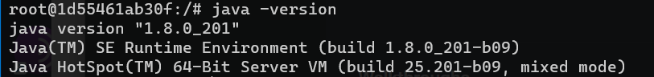

6. 安装配置`hadoop`

- 
- `hadoop-3.1.2.tar.gz`为例

```bash

sudo tar -zxvf  /home/shareFiles/hadoop-3.1.2.tar.gz  -C  /usr/local    #解压到/usr/local目录下
cd /usr/local
sudo mv  hadoop-3.1.2    hadoop                     #重命名为hadoop
sudo chown -R hadoop ./hadoop         #修改文件权限，根据实际情况确定用户名
vim ~/.bashrc # 给环境变量添加jdk
```

- 注意不同用户的环境变量不同，需要在不同用户下添加环境变量

```bash
# .bashrc文件添加如下内容
export HADOOP_HOME=/usr/local/hadoop
export HADOOP_COMMON_LIB_NATIVE_DIR=$HADOOP_HOME/lib/native
export PATH=$PATH:$HADOOP_HOME/bin:$HADOOP_HOME/sbin

```

```bash
source ~/.bashrc # 使环境变量生效

hadoop version # 查看hadoop版本
```

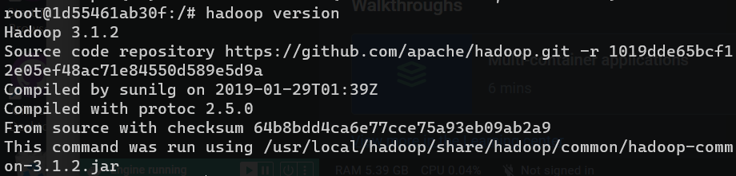

#### 配置hadoop

1. 伪分布式配置

Hadoop 可以在单节点上以伪分布式的方式运行，Hadoop 进程以分离的 Java 进程来运行，节点既作为 NameNode 也作为 DataNode，同时，读取的是 HDFS 中的文件。Hadoop 的配置文件位于` /usr/local/hadoop/etc/hadoop/ `中，伪分布式需要修改2个配置文件 `core-site.xml` 和 `hdfs-site.xml` 。Hadoop的配置文件是 xml 格式，每个配置以声明 property 的 name 和 value 的方式来实现。

```bash
#首先将jdk1.8的路径添（`export JAVA_HOME=/usr/lib/jvm/java` ）加到hadoop-env.sh文件 

sudo vim /usr/local/hadoop/etc/hadoop/hadoop-env.sh
# 在文件中添加如下内容
export JAVA_HOME=/usr/lib/jvm/java

# 修改core-site.xml文件
sudo vim /usr/local/hadoop/etc/hadoop/core-site.xml

```

```xml
#在文件中添加如下内容

<configuration>
  	      <property>
             <name>hadoop.tmp.dir</name>
             <value>file:/usr/local/hadoop/tmp</value>
             <description>A base for other temporary directories.</description>
        </property>
        <property>
             <name>fs.defaultFS</name>
             <value>hdfs://localhost:9000</value>
        </property>
</configuration>

```

```bash
# 修改hdfs-site.xml文件
sudo vim /usr/local/hadoop/etc/hadoop/hdfs-site.xml

```

```xml
<configuration>
        <property>
             <name>dfs.replication</name>
             <value>1</value>
        </property>
        <property>
             <name>dfs.namenode.name.dir</name>
             <value>file:/usr/local/hadoop/tmp/dfs/name</value>
        </property>
        <property>
             <name>dfs.datanode.data.dir</name>
             <value>file:/usr/local/hadoop/tmp/dfs/data</value>
        </property>
</configuration>
    
```

- Hadoop 的运行方式是由配置文件决定的（运行 Hadoop 时会读取配置文件），因此如果需要从伪分布式模式切换回非分布式模式，需要删除 core-site.xml 中的配置项。此外，伪分布式虽然只需要配置 fs.defaultFS 和 dfs.replication 就可以运行（可参考官方教程），不过若没有配置 hadoop.tmp.dir 参数，则默认使用的临时目录为 /tmp/hadoo-hadoop，而这个目录在重启时有可能被系统清理掉，导致必须重新执行 format 才行。所以我们进行了设置，同时也指定 dfs.namenode.name.dir 和 dfs.datanode.data.dir，否则在接下来的步骤中可能会出错。

2. NameNode 格式化

```bash

#注意切换到hadoop用户下执行命令
#/usr/local/hadoop/bin/hdfs namenode –format
hdfs namenode -format

```

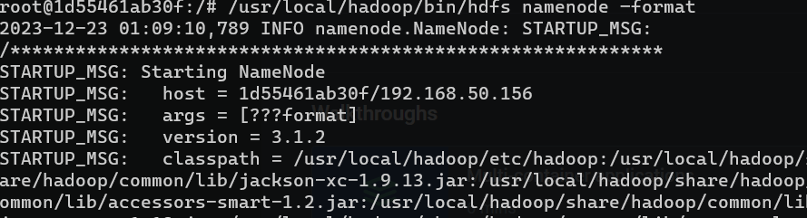

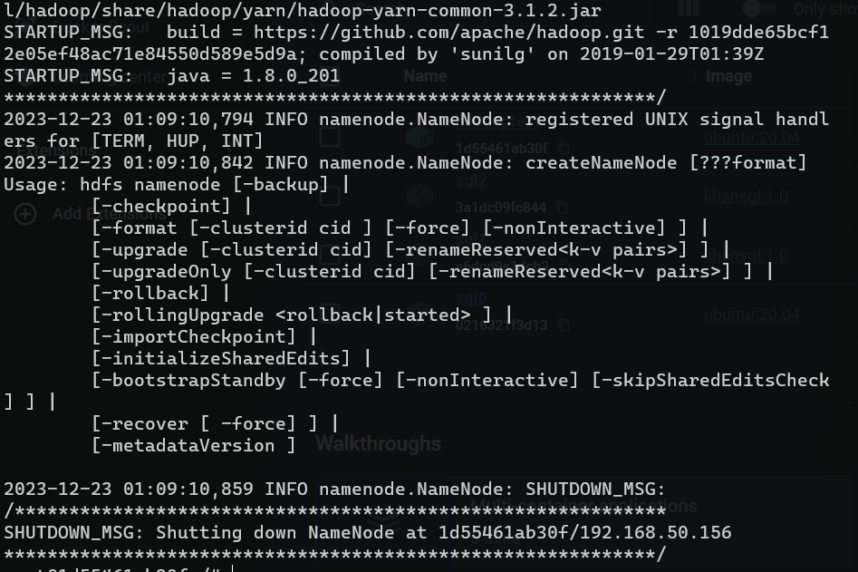

- 问题1：
`hdfs namenode -format`报错

- 解决1：
手动输入，可能有奇怪的空格

```bash
#启动namenode和datanode进程，并查看启动结果
su hadoop
sudo service ssh start
#/usr/local/hadoop/sbin/start-dfs.sh
start-dfs.sh
# 启动完成后，通过命令 jps 来判断是否成功启动
jps

```

- 问题1：
`/usr/local/hadoop/sbin/start-dfs.sh`报错

- 解决1：
- - 注意切换到hadoop用户下执行命令
- - 注意检查ssh是否在运行`sudo service ssh status`

- 问题2：
`1d55461ab30f: ERROR: Unable to write in /usr/local/hadoop/logs. Aborting.`报错

- 解决2：
- - `sudo chown -R hadoop /usr/local/hadoop/logs`修改文件权限

- 问题3：
`WARN util.NativeCodeLoader: Unable to load native-hadoop library for your platform... using builtin-java classes where applicable`报错

- 解决3：

解决方案是在文件hadoop-env.sh中增加：
export HADOOP_OPTS="-Djava.library.path=${HADOOP_HOME}/lib/native"  


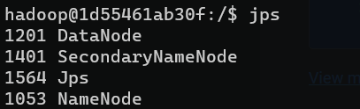

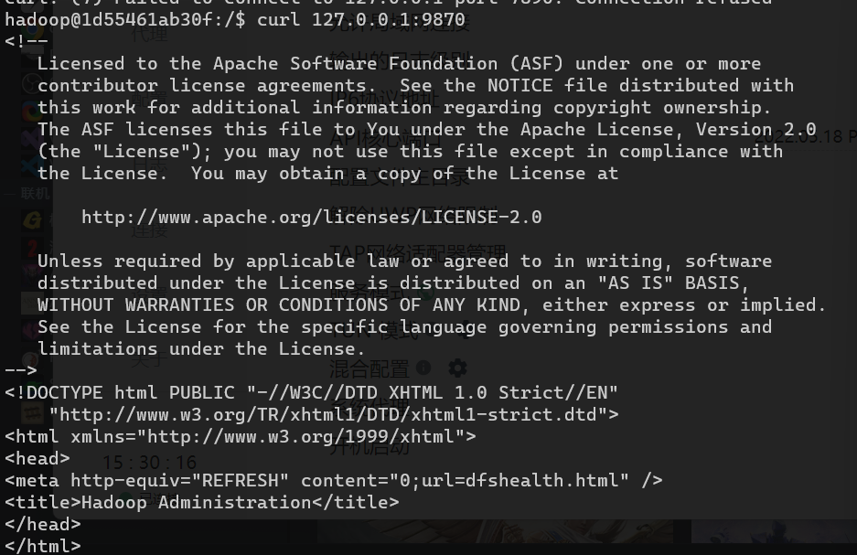

3. 启动Hadoop例子

```bash
#创建执行MapReduce作业所需的 DFS 目录:

hdfs dfs -mkdir /user
hdfs dfs -mkdir /user/<username>     #<username> 问用户名，如hadoop

#拷贝输入文件到分布式文件系统:

hdfs dfs  -put  /usr/local/hadoop/etc/hadoop  input

#可以运行一些例子:

hadoop jar /usr/local/hadoop/share/hadoop/mapreduce/hadoop-mapreduce-examples-3.1.2.jar grep input output 'dfs[a-z.]+'

#查看输出的文件(files): 从分布式文件系统中拷贝文件到本地文件系统并查看:

hdfs dfs -get output /usr/local/hadoop/output
cat /usr/local/hadoop/output/*

#或者直接在分布式文件系统上查看:

hdfs dfs -cat output/*
```

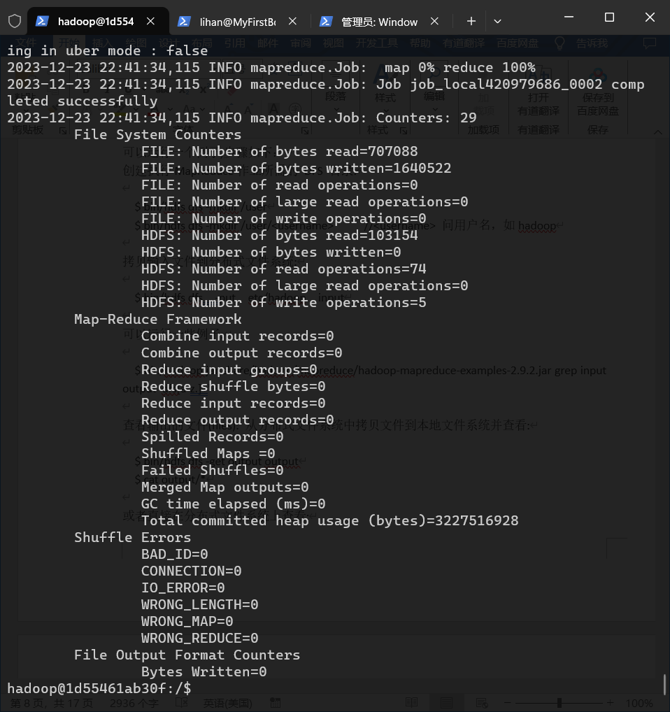

4. YARN 单机配置

- 通过设置几个参数并运行ResourceManager daemon and NodeManager daemon，你可以在YARN上以伪分布模式运行MapReduce job。

```bash
vim /usr/local/hadoop/etc/hadoop/mapred-site.xml
#修改mapred-site.xml文件

<configuration>
    <property>
        <name>mapreduce.framework.name</name>
        <value>yarn</value>
    </property>
</configuration>

vim /usr/local/hadoop/etc/hadoop/yarn-site.xml
#修改yarn-site.xml文件

<configuration>
    <property>
        <name>yarn.nodemanager.aux-services</name>
        <value>mapreduce_shuffle</value>
    </property>
</configuration>

# 启动ResourceManager daemon 和 NodeManager daemon:
start-yarn.sh

ResourceManager - http://localhost:8088/

#可以通过下列命令停止hadoop和YARN
stop-dfs.sh
stop-yarn.sh

```

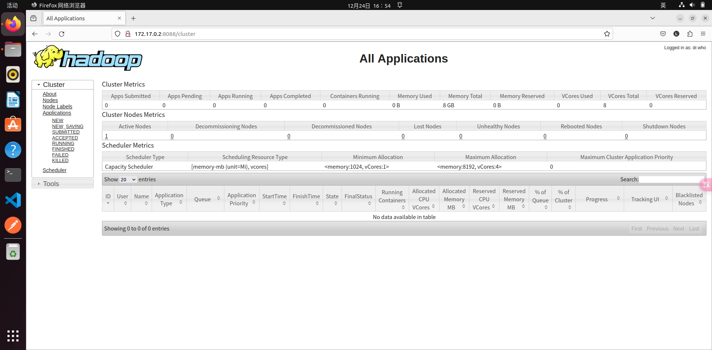


#### 配置hbase

1. 安装配置`hbase`

- `hbase-1.2.11-bin.tar.gz`

```bash
# 解压

sudo tar -zxvf  /home/shareFiles/hbase-1.2.11-bin.tar.gz -C /usr/local

sudo mv /usr/local/hbase-1.2.11  /usr/local/hbase

cd /usr/local
sudo chown -R hadoop /usr/local/hbase

# 配置环境变量
vim ~/.bashrc
# .bashrc文件添加如下内容
export PATH=$PATH:/usr/local/hbase/bin

source ~/.bashrc # 使环境变量生效

# 查看版本
hbase version

```

2. 配置hbase

- 单机配置（可能需要配置JAVA_HOME环境变量， 由于本实验指南在HADOOP安装时已配置，故省略）

```bash

# 修改hbase-site.sh文件
sudo vim /usr/local/hbase/conf/hbase-site.xml

# 在文件中添加如下内容
<configuration>
        <property>
                <name>hbase.rootdir</name>
                <value>file:///usr/local/hbase/hbase-tmp</value>
        </property>
</configuration>

#采用如下命令启动服务、查看进程和启动客户端
cd /usr/local/hbase
#/usr/local/hbase/bin/start-hbase.sh
start-hbase.sh
jps
#/usr/local/hbase/bin/hbase shell
hbase shell


```

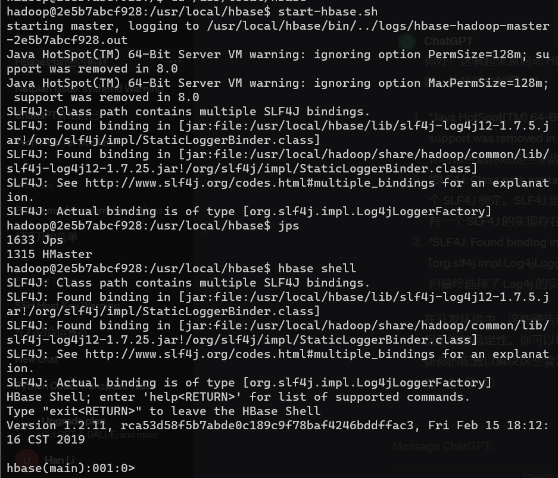

- 下面为配置伪分布模式的指南

```bash
# 修改hbase-env.sh文件
#在conf/hbase-env.sh文件里设置 JAVA_HOME 环境变量. 首先确定java安装位置，本实验为：usr/lib/jvm/java，然后编辑 conf/hbase-env.sh 文件,
sudo vim /usr/local/hbase/conf/hbase-env.sh
#加入：
export JAVA_HOME=/usr/lib/jvm/java

# 修改hbase-site.xml文件
sudo vim /usr/local/hbase/conf/hbase-site.xml
# 添加
<property>
        <name>hbase.cluster.distributed</name>
        <value>true</value>
</property>

# 启动
start-dfs.sh
cd /usr/local/hbase/bin
start-hbase.sh
jps

```

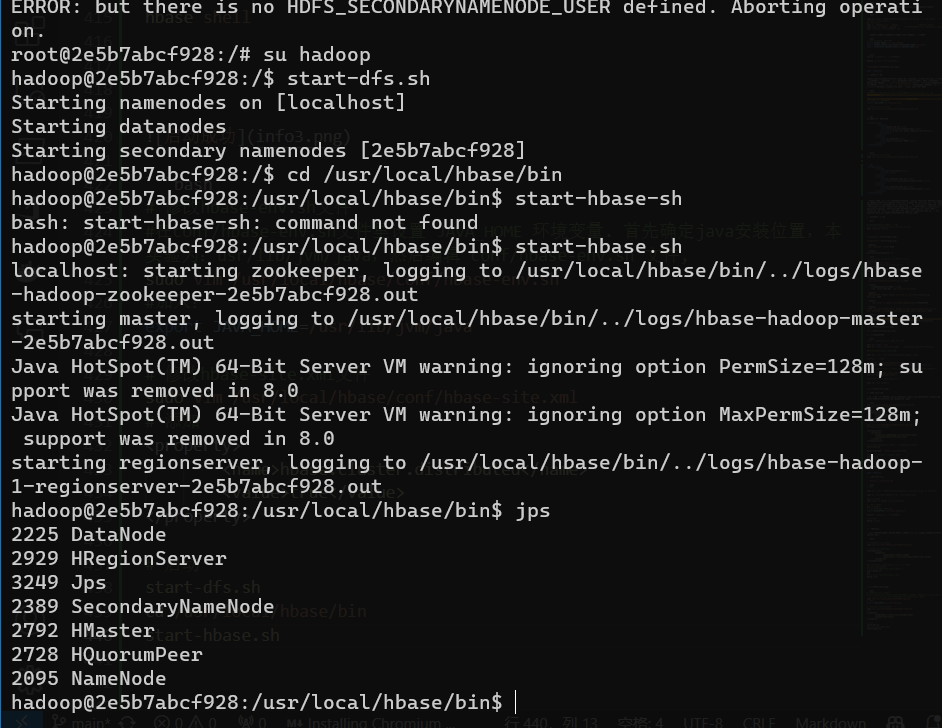

```bash

3. 操作hbase

```bash
# Start a backup HBase Master (HMaster) server.（仅仅为了测试和学习，生产环境不会在一台机器上启动备份master）
# HMaster服务器控制 HBase集群. 你可以启动最多9个后备HMaster。
# 用 localmaster-backup.sh启动. 为每个后背HMaster加一个16000端口之上的偏移量。 启动后可以查看结果。
local-master-backup.sh start 2 3 5

jps
# 启动和停止附加区域服务器RegionServers
local-regionservers.sh start 2 3 4 5

#进入交互界面
hbase shell

# 进行一些基本数据库操作

## 创建表(使用create命令创建一个新表.你必须规定表名和列族名)

create 'test', 'cf'

## 查看表
### list 命令可以显示表信息

list 'test'

### describe 命令显示表的详细信息

describe 'test'

## 插入数据

### put

put 'test', 'row1', 'cf:a', 'value1'
put 'test', 'row2', 'cf:b', 'value2'
put 'test', 'row3', 'cf:c', 'value3'

## 扫描表 使用scan 命令扫描整个表取得数据 

scan 'test'

## 取一行数据，使用get指令

get 'test', 'row1'

## 修改表模式，使用alter命令，如修改存储版本数

disable 'test'
alter 'test', NAME => 'cf', VERSIONS => 5
enable 'test'

## 删除表，使用drop命令

disable 'test'
drop 'test'

```

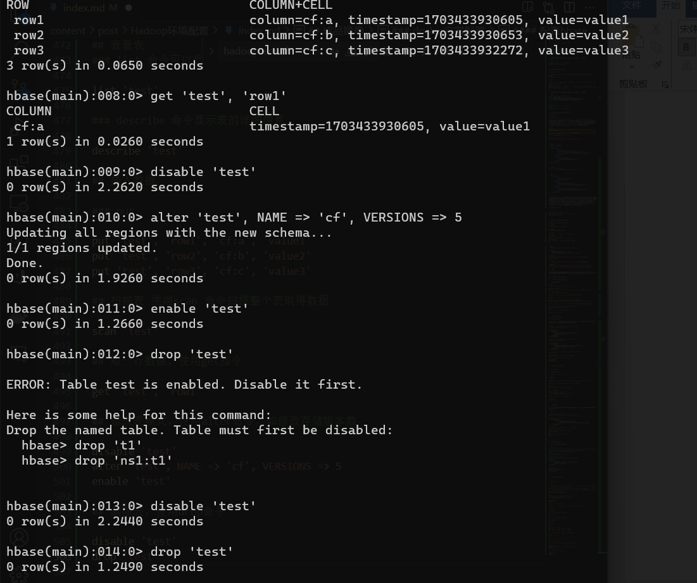

## 思考题：

- 1 请问伪分布和分布式的含义有何不同？就本实验，你是如何理解在一台计算机上做到“伪分布”的？

伪分布通常指的是在单台计算机上模拟分布式环境，即将分布式系统的各个组件部署在同一台机器上，以方便开发和调试。而分布式系统是在多台计算机上部署的系统，各个计算机之间通过网络进行通信和协作。

在一台计算机上实现“伪分布”通常是为了方便在单机上测试和调试分布式系统的各个组件，以便更好地理解和解决分布式系统的问题。

- 2 在1.2小节进行安装SSH并设置SSH无密码登陆，请问这个安装的目的是什么？

在1.2小节进行安装SSH并设置SSH无密码登录的目的是为了实现集群中各个节点之间的安全通信。SSH（Secure Shell）是一种加密的网络协议，通过在集群节点之间建立SSH无密码登录，可以实现在节点之间的安全通信，方便集群管理和操作

- 3 如果继续向Hbase的test表中put行键为”row1”，值为其它字符串的数据，put ‘test’ ,’row1’, ‘cf:a’, ‘value6’，会发生什么？如果采用语句get ‘test’, ‘row1’, {COLUMN=>’cf:a’, VERSIONS=>3} 进行查询，分析你得到的结果。put与关系数据库的插入有何不同？

这将在test表的row1行的cf:a列插入新的值'value6'。如果之前已经存在相同行键和列族的数据，它会被覆盖。

对于查询语句：

javascript

get 'test', 'row1', {COLUMN=>'cf:a', VERSIONS=>3}

这将获取test表中row1行cf:a列的最近3个版本的数据。如果之前的put操作执行成功，你可能会得到包含'value6'的结果。

相较于关系数据库的插入，HBase是一种NoSQL数据库，支持灵活的列族和列的存储，而不需要提前定义表的结构。插入数据时，可以方便地插入不同列族的数据，而不受严格的表结构限制。


