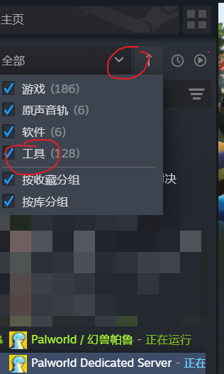
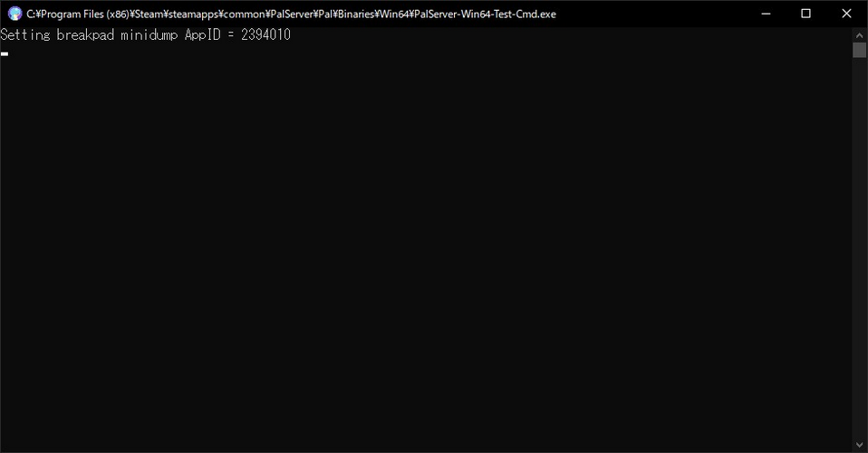
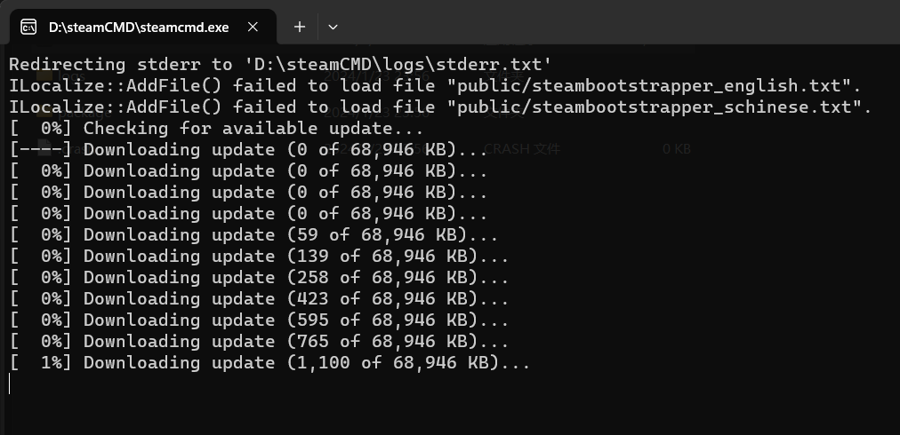

# 前言

幻兽帕鲁(Palworld)是一个抓宝可梦打黑工的开放世界冒险游戏，我想实现24h不间断的服务器以供朋友们随时上号可以继续建设共同的世界，不必等待房主上号。

这需要利用游戏提供的`幻兽帕鲁私有服务器(Palworld Dedicated Server)`工具实现。

# 环境

- windows 11
- Ubuntu 22.04

- 服务器配置

| CPU | RAM | Network |
| --- | --- | --- |
| 4核 | 16G | UDP端口8211 端口转发 |


# 参考

- [官方开服教程](https://tech.palworldgame.com/dedicated-server-guide)
- [steamcmd](https://developer.valvesoftware.com/wiki/SteamCMD)

# 服务器搭建操作

## windows 11

### 安装官方开服软件

购买游戏后，在steam库中的工具中找到`Palworld Dedicated Server`并下载安装。



### 配置开服软件

打开安装好的开服软件，选择`Play Palworld Dedicated Server`启动



## steamCMD-Windows

[官网](https://developer.valvesoftware.com/wiki/SteamCMD#Downloading_SteamCMD)下载后，新建文件夹`steamCMD`作为安装目录，解压到该目录下并运行。



- 下载完成后，设置游戏安装目录

```bash
force_install_dir D:\steamCMD\palworld
```

- 登录

```bash
# 匿名登陆

login anonymous

# 或者使用账号密码登陆

login username 
# 输入密码
```

- 下载更新游戏

```bash

app_update <app_id> [-beta <betaname>] [-betapassword <password>] [validate]

# app_id 为游戏的id，beta为测试版本，有的beta版本有密码，validate为验证文件完整性

# 以幻兽帕鲁为例
# app_update 2394010 validate
```

### steamcmd中下载幻兽帕鲁

```bash
# steamcmd
login anonymous
app_update 2394010 validate
quit
```

### 配置开服软件

```bash
# windows命令行
cd D:\steamCMD\steamapps\common\PalServer
PalServer.exe
```

- 报错:缺少Vc++runtime，DirectX，

- 下载[微软常用运行库](https://pan.quark.cn/s/cb49a332907e 作者：bili_3493079524838071 https://www.bilibili.com/read/cv21613227/ 出处：bilibili)
- 下载[DirectX](https://download.microsoft.com/download/1/7/1/1718CCC4-6315-4D8E-9543-8E28A4E18C4C/dxwebsetup.exe)

## steamCMD-Ubuntu

```bash

# 作为root用户，创建steam用户：

sudo useradd -m steam
sudo passwd steam

# 进入其主文件夹：

sudo -u steam -s
cd /home/steam

# 如果无权限sudo
# 切到root用户，修改/etc/sudoers文件，添加一行：
# steam   ALL=(ALL:ALL) ALL

# 下载steamcmd：

sudo add-apt-repository multiverse; sudo dpkg --add-architecture i386; sudo apt update
sudo apt install steamcmd
```

- 其他同[steamCMD-Windows](#steamcmd-windows)操作

- 运行`./PalServer.sh`启动服务器

- 报错:.steam/sdk64/steamclient.so: cannot open shared object file: No such file or directory
    
```bash
mkdir -p ~/.steam/sdk64/
steamcmd +login anonymous +app_update 1007 +quit
cp ~/Steam/steamapps/common/Steamworks\ SDK\ Redist/linux64/steamclient.so ~/.steam/sdk64/
```

之后就好了，不用管报错。

## steamCMD-Docker

```bash
# wsl

# 下载并启动镜像
docker run -di --name=steamcmd cm2network/steamcmd 

docker exec -it steamcmd /bin/bash

# steamcmd.sh 位于 /home/steam/steamcmd

```

- 其他同[steamCMD-Ubuntu](#steamcmd-ubuntu)操作

# 服务器存档及转移问题

- 目前只在windows下steamcmd测试过，其他系统未知

## 存档

- 专属服务器存档位置

`[steamcmd的steamapps路径]\common\PalServer\Pal\Saved\SaveGames\0\[存档名]`

- 例如

`D:\steamCMD\steamapps\common\PalServer\Pal\Saved\SaveGames\0\1865165198165165091`

## 存档结构

```bash
.
├── Level.sav                  #地图数据
├── LevelMeta.sav
└── Players
    ├── 8HIHSUBI0000000000.sav #玩家数据(steam游戏id)
    └── 88UKBUE30000000000.sav 

```

## 配置文件

- `.\steamapps\common\PalServer\DefaultPalWorldSettings.ini`文件是默认配置文件模板。

- `.\steamapps\common\PalServer\Pal\Saved\Config\WindowsServer\PalWorldSettings.ini`是服务器配置文件

- `D:\steamCMD\steamapps\common\PalServer\Pal\Binaries\Win64\steam_appid.txt`是steam游戏id

## 服务器转移

- 转移服务器只需要复制替换前文提到的文件或目录:
- - `[steamcmd的steamapps路径]\common\PalServer\Pal\Saved`游戏存档文件夹
- - `.\steamapps\common\PalServer\DefaultPalWorldSettings.ini`默认配置模板
- - `.\steamapps\common\PalServer\Pal\Saved\Config\WindowsServer\PalWorldSettings.ini`配置
- - `D:\steamCMD\steamapps\common\PalServer\Pal\Binaries\Win64\steam_appid.txt`steam游戏id(电脑上装了steam和没装，启动steamcmd的palServer的steam_appid.txt不一样)


# 游戏优化

- 这op游戏有很多问题，内存优化等

## 内存优化

- [ ] 定期重启服务器(弃用)

有个大佬做了程序，仓库有教程

[PalworldServerAutoRestart](https://github.com/Hoshinonyaruko/palworld-go)

使用流程大概就是下载exe，放在PalServer目录下，启动一下，会出现个config.json，跟着教程改一下，打开没问题，开着这个再开着游戏就ok了

- [ ] 服务器内存优化(memreduct)

[memreduct](https://github.com/henrypp/memreduct/)是一个内存优化工具，可以在windows下使用。

下载后，打开，按照默认设置，选择到80%或者自定义的值就清理。去掉清理提示。

## 存档自动备份

由于游戏不是很稳定，加上服务器不稳定，存档迁移等原因，最好定期备份存档。

我自己写了个每分钟备份一次存档，保留最新100次存档的小程序，后续还会继续优化。

目前只保证在winodws上的steamcmd运行的PalServer存档备份(我只测试了这个嘿嘿)。

下载地址:[backupPal](https://github.com/lihan3238/PalworldBackup/releases/latest)


