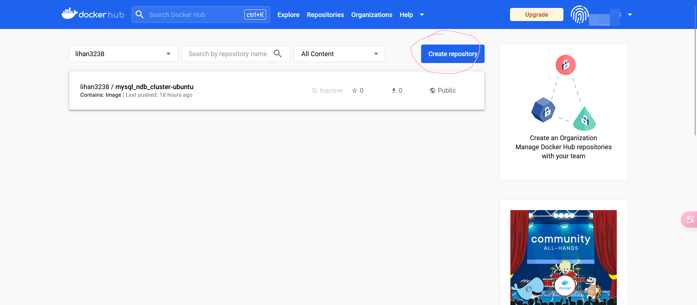

## 1. 在dockerhub上创建一个repository



登录[dockerhub](https://hub.docker.com/)网站后，点击上图圈处创建新仓库。

## 2. 给本地镜像打上tag

```bash
# tag格式
docker tag <本地镜像名> <dockerhub用户名>/<仓库名>:<tag>
# 有一个名为`lihan_ndbmgm:1.0`的镜像
docker tag lihan_ndbmgm:1.0 lihan3238/mysql_ndb_cluster-ubuntu:lihan_ndbmgm`
```

- tips

此时本地出现两个tag指向同一个镜像，分别是原来的`lihan_ndbmgm:1.0`和新的`lihan3238/mysql_ndb_cluster-ubuntu:lihan_ndbmgm`。
使用`docker rmi`命令任意删除一个tag不会影响镜像的使用。

## 3. push镜像

```bash
# 命令行登录docker
docker login -u lalalalal --password-stdin balabala docker.io
# push镜像
docker push lihan3238/mysql_ndb_cluster-ubuntu:lihan_ndbmgm
```

```bash
