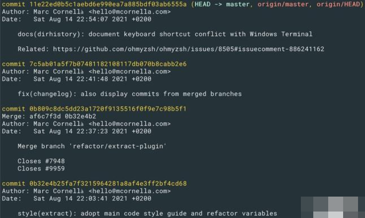

## commit message格式
`<type>(<scope>): <subject>`
`<commit类型>(影响范围): 具体描述`
## 具体描述举例
`fix(DAO): fixed invalid user table indexes.`

## 解释

- type

type指明git commit的类别，应该使用以下类型，也可根据团队自行增减

- - 『feat』: 新增功能
- - 『fix』: 修复 bug
- - 『docs』: 仅仅修改了文档，比如 README, CHANGELOG等等
- - 『test』: 增加/修改测试用例，包括单元测试、集成测试等
- - 『style』: 修改了空行、缩进格式、引用包排序等等（不改变代码逻辑）
- - 『perf』: 优化相关内容，比如提升性能、体验、算法等
- - 『refactor』: 代码重构，「没有新功能或者bug修复」
- - 『chore』: 改变构建流程、或者增加依赖库、工具等
- - 『revert』: 回滚到上一个版本
- - 『merge』: 代码合并scope（可选）

- scope

用于说明 commit 影响的范围，根据不同项目有不同层次描述。若没有特殊规定，也可以描述影响的哪些功能等。

- subject

subject是commit目的的简短描述，不超过50/80个字符，一般git提交的时候会有颜色提示。

- - 若英文用不惯，那么推荐使用中文若是开源代码，一律推荐统一英文，
- - 英文不行可以翻译软件用起来
- - 若是开源代码，可以再附加对应的issue地址
- - 结尾不加标点符号

## oh-my-zsh git commit示例

这里给出常用的oh-my-zsh的git commit的截图，采用的就是上述规范：

