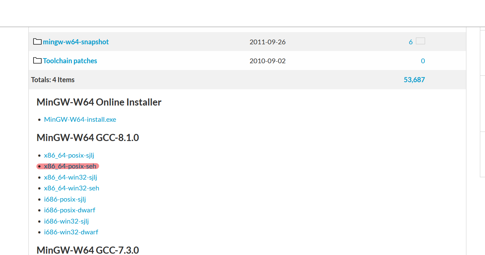
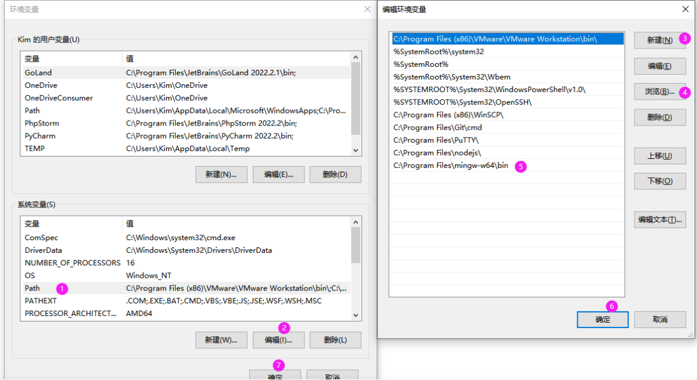

# hugo网站搭建

## 1.前置条件
- [go](https://github.com/golang/go)
- [git](https://git-scm.com/book/en/v2/Getting-Started-Installing-Git)
- [hugo](https://gohugo.io/)
- [hugo下载](https://github.com/gohugoio/hugo)

### 1.1 hugo下载安装
```
go env -w CGO_ENABLED=1
go install -tags extended github.com/gohugoio/hugo@latest
```
如果出现gcc报错，需要根据如下流程安装gcc
1. 打开链接[下载](https://sourceforge.net/projects/mingw-w64/files/mingw-w64/)
2. 选择版本下载（win11为例）

3. 解压到目录
C:\Program Files (x86)\mingw64
4. 设置环境变量

### 1.2 hugo使用
[参考文档](https://gohugo.io/getting-started/quick-start/)
[中文文档](https://www.gohugo.org/doc/overview/quickstart/)

### 1.3 github部署hugo模板
1. 在github创建仓库
`Repository name`那一栏，格式为`<name>.github.io`。如果你想让你的博客网址就是`.github.io`，则`<name>`不能是任意名字，必须是你的github用户名。
2. gitclone仓库到本地
3. 下载主题模板到本地文件夹内并git push
4. 进入`https://github.com/<name>/<name>.github.io`点击上方栏的`Settings`，然后点击左方栏的`Pages`，在`Build and deployment`里的`Source`中选择`Github Actions`，在下面找到`Hugo`，点击`Configure`，在新界面点击右侧的绿色按钮的`Commit changes...`。
找不到`Hugo`就去`browse all workflows`里找。
5. 后续写博客
后续更新只需要在`content`文件夹加入md文件，然后执行

### 1.4 links

在某一博的frontmatter中加入如下内容即可

```yaml
links:
  - title: GitHub
    description: GitHub is the world's largest software development platform.
    website: https://github.com
    image: https://github.githubassets.com/images/modules/logos_page/GitHub-Mark.png
  - title: TypeScript
    description: TypeScript is a typed superset of JavaScript that compiles to plain JavaScript.
    website: https://www.typescriptlang.org
    image: ts-logo-128.jpg
```

`image` 允许在线图片和本地图片，如果是本地图片，需要放在 `static` 文件夹下，然后使用相对路径引用。

### 1.5 基于gitalk的评论区

- 使用 GitHub 登录
- 支持多语言 [en, zh-CN, zh-TW, es-ES, fr, ru, de, pl, ko, fa, ja]
- 支持个人或组织
- 无干扰模式（设置 distractionFreeMode 为 true 开启）
- 快捷键提交评论 （cmd|ctrl + enter）

[Readme](https://github.com/gitalk/gitalk/blob/master/readme.md)
[在线示例](https://gitalk.github.io)

#### 安装

两种方式

- 直接引入

```html
  <link rel="stylesheet" href="https://cdn.jsdelivr.net/npm/gitalk@1/dist/gitalk.css">
  <script src="https://cdn.jsdelivr.net/npm/gitalk@1/dist/gitalk.min.js"></script>

  <!-- or -->

  <link rel="stylesheet" href="https://unpkg.com/gitalk/dist/gitalk.css">
  <script src="https://unpkg.com/gitalk/dist/gitalk.min.js"></script>
```

- npm 安装

```sh
npm i --save gitalk
```

```js
import 'gitalk/dist/gitalk.css'
import Gitalk from 'gitalk'
```

#### 使用

首先，您需要选择一个公共github存储库（已存在或创建一个新的github存储库）用于存储评论，

然后需要创建 **GitHub Application**，如果没有 [点击这里申请](https://github.com/settings/applications/new)，`Authorization callback URL` 填写当前使用插件页面的域名。

最后, 您可以选择如下的其中一种方式应用到页面：
#### 在hugo的网站文件夹下的config/params.toml下填写

```js
[comments.gitalk]
  clientID = "id"
  clientSecret = "cs"
  repo = "lihan3238.github.io",//博客网站仓库名字
  owner = "lihan3238",//github用户名
  admin = ["lihan3238"],//github用户名（仓库有权写写入的人）
  perpage = 10//每页多少个评论
  pagerDirection = "last"//排序方式"last/first"
  createIssueManually = true//管理员是否手动创建issue
  distractionFreeMode = false//是否开启无干扰模式（cmd|ctrl+enter）自动发送评论
  labels = "gitalk"//issue标签
  id = "lihan3238.github.io"//页面唯一id
```
#### 问题

1. 评论区报错
```
未找到相关的 Issues 进行评论

请联系 @[lihan3238] 初始化创建
```
- 解决方法：
管理员账户登录评论区即可

