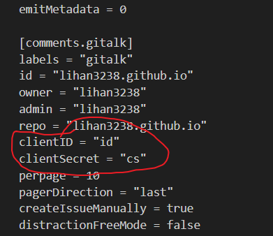
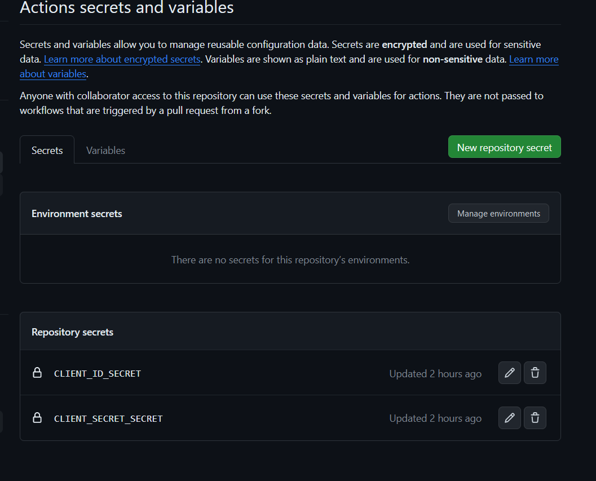

# 问题

在使用github仓库时，会出现有意或无意commit甚至push了包含隐私信息(密码、身份信息等)的文件。

# 原因

使用`github action``github pages`时，`workflow`等可能需要依赖`token`或密码等。
此外，即使删除了文件，但是仓库中的`commit`历史记录中仍然会存在，也需要进行处理。

# 解决方案

1. `github action secret`加密隐私信息

利用github提供的`github action secret`功能，将`token`等信息保存在`secret`中，然后在`workflow`中调用`secret`中的信息。

- 实际上，通过在workflow中增加临时修改文件的操作，也可以实现对所有文件中的隐私信息替换，而不仅是workflow目录下的文件中的隐私信息替换
。

以我的个人博客为例，由于个人博客中的`gitalk`评论区插件需要依赖`github outh app`，因此需要在`workflow`中调用`github action secret`中的`token`信息。

相关数据保存在`config/_default/params.toml`文件中。

```toml

...

repo = "lihan3238.github.io"
clientID = "1eda156wa"
clientSecret = "5168165"

...

```

注意到，文件中的隐私信息是明文保存的，任何访问者都能直接看到，很危险。


首先将原文替换为特定字符串

```toml
repo = "lihan3238.github.io"
clientID = "id"
clientSecret = "cs"
```

打开`https://[仓库地址]/settings/secrets/actions`(例如)
添加`secret`，并将`token`等信息保存在`secret`中。



然后在`workflow`中添加进行替换的代码

```yml
jobs:
  # Update config file job
  update_config_file:
    runs-on: ubuntu-latest

    steps:
    - name: Checkout repository
      uses: actions/checkout@v2

    - name: Modify config file
      run: |
        CLIENT_ID_SECRET=${{ secrets.CLIENT_ID_SECRET }}
        CLIENT_SECRET_SECRET=${{ secrets.CLIENT_SECRET_SECRET }}

        sed -i "s/clientID = \"id\"/clientID = \"$CLIENT_ID_SECRET\"/" ${{ github.workspace }}/config/_default/params.toml
        sed -i "s/clientSecret = \"cs\"/clientSecret = \"$CLIENT_SECRET_SECRET\"/" ${{ github.workspace }}/config/_default/params.toml
   build:
    runs-on: ubuntu-latest
    env:
      HUGO_VERSION: 0.114.0
    # ！！！！！！！！！记得给之后的步骤添加依赖needs，不然谁知道先执行哪个！！！！！！！！
    # !!!!!!!!!要在同一个jobs里，不同步骤，好像不在一个job可能有问题
    needs: update_config_file
    steps:
   
    ···

```

2. `bfg`删除历史`commit`中的隐私信息

`bfg`是一个用于清除git仓库中大文件的工具，可以用于清除历史`commit`中的隐私信息。

前往[官网](https://rtyley.github.io/bfg-repo-cleaner/),[下载](https://repo1.maven.org/maven2/com/madgag/bfg/1.14.0/bfg-1.14.0.jar)`bfg`工具的jar包，然后在本地仓库目录下命令行中运行命令

```bash
java -jar [bfg.jar的绝对路径] --delete-files [要删除记录的文件名(不用地址)]
# 强制更新远程仓库
git push --force
```