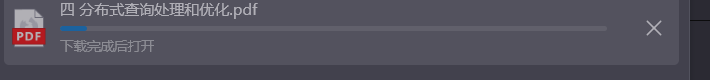

# 问题

如上图，使用畅课(TronClass)平台时，老师可能有意无意未开放课件等资料的下载权限，导致无法下载。

# 解决方案

使用浏览器的开发者工具，查看网页源代码，找到课件下载。

1. 在待下载的资料页面打开浏览器的`开发者工具`，一般快捷键是`f12`，选择`网络`页面，如下图所示：

2. 点开资料，图例中为`pdf课件`，在`网络`的筛选条件中输入`pdf`，找到对应的`网络资源`，如下图所示：

3. 右键后点击`新建标签页打开`，即可下载。

4. 如图，下载成功。

