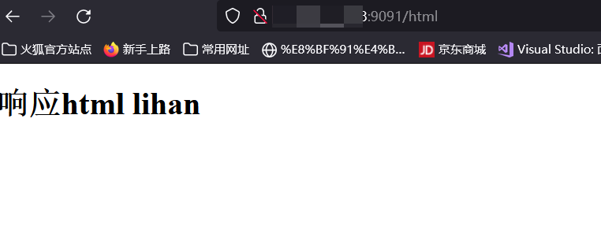

# 云服务器上线网站

## 购买域名

- 域名购买网站：[Godaddy](https://www.godaddy.com/)

购买方式略，这就不用教了吧。

使用的话

## 云服务器

### Microsoft_Azure_Education免费云服务器

#### 注册认证学生计划

在[Github教育](https://education.github.com)上完成学生认证(百度教程，大概就是上传学信网的英文翻译版学历认证.pdf，能不开魔法就不开，学校教育邮箱认证)后，登录[azure](https://azure.microsoft.com/zh-cn/free/students/),绑定github，不行就在azure重新认证一下学生，就好了，自己研究一下，他这个有点小bug。主要就是这俩按钮:


#### 创建VPS

1. 在哪里创建虚拟机 

进入[azure个人仪表盘](https://portal.azure.com/#view/Microsoft_Azure_Education/EducationMenuBlade/~/overview),点击`免费服务`-`浏览所有`，根据需要选择创建的虚拟机:


2. 配置虚拟机

网上搜了搜，好像现版本答案(2023.10.16)是`Debian`,`Centos`是上个版本答案，那就先选Debian了。

- 虚拟机名称：lihanDebian11AzureVPS
- 区域：(US) East US
- 系统：Debian 11 (Bullseye) - x64 Gen2
- 大小：Standard B1s - 1 vcpu, 1 GiB memory

- 管理员账户SSH
- - 用户名：lihan3238
- - SSH公钥源：生成新的密钥对
- - 密钥对名称：lihanDebian11AzureVPS_key

- 入站端口规则
- - 入站端口：SSH(22)


创建虚拟机后，会下载一个私钥`lihanDebian11AzureVPS_key.pem`，这个私钥是用来连接虚拟机的，所以要保存好，不然就要重新生成密钥对了。

3. 连接虚拟机

进入VPS页面，点击连接，选择`本机SSH`,根据提示SSH连接。


以Windows11的命令行`Windows Powershell`进行SSH连接为例:

将私钥`lihanDebian11AzureVPS_key.pem`放到`C:\Users\[用户名]\.ssh\`目录下，并在`C:\Users\[用户名]\.ssh\config`文件中添加如下内容:

```powershell
Host [VPS公共ip]
  HostName [VPS公共ip]
  IdentityFile ~/.ssh/lihanDebian11AzureVPS_key.pem
  User lihan3238    # 这里是你创建VPS时设置的用户名
```

然后在`Windows Powershell`中输入`ssh lihan3238@[VPS公共ip]`即可连接VPS。

#### 配置VPS

##### 本地虚拟机测试docker

1. Gin

```bash
docker pull golang
# web1目录下放置gin框架搭建的网站
# 不知道为什么，这里的web1目录不能加`/home/`
docker run -di --name lihanGinServer -v /home/lihan/VPStest/gin/web1:/go/web1 golang
# 运行gin网站
sudo docker exec -di lihanGinServer /bin/bash -c "cd web1/;go run main.go"
```
2. Nginx

```bash
docker pull nginx
# 在宿主机上创建/home/lihan/VPStest/nginx目录，目录下创建www、conf、logs目录，conf目录下创建nginx.conf文件，分别挂载到容器中
docker run -di -p 9091:80  --name lihanNginxServer -v /home/lihan/VPStest/nginx/www:/usr/share/nginx/html -v /home/lihan/VPStest/nginx/conf/nginx.conf:/etc/nginx/nginx.conf -v /home/lihan/VPStest/nginx/logs:/var/log/nginx nginx
```
- nginx配置示例
  
```bash
user  nginx;
worker_processes  auto;

error_log  /var/log/nginx/error.log notice;
pid        /var/run/nginx.pid;


events {
    worker_connections  1024;
}


http {
    include       /etc/nginx/mime.types;
    default_type  application/octet-stream;

    log_format  main  '$remote_addr - $remote_user [$time_local] "$request" '
                      '$status $body_bytes_sent "$http_referer" '
                      '"$http_user_agent" "$http_x_forwarded_for"';

    access_log  /var/log/nginx/access.log  main;

    sendfile        on;
    #tcp_nopush     on;

    keepalive_timeout  65;

    #gzip  on;

    #include /etc/nginx/conf.d/*.conf;
    upstream gin {
        server 172.17.0.2:8080;
    }
    server {
        listen 80;
        location / {
            proxy_pass http://gin;
            #Proxy Settings
            proxy_redirect off;
            proxy_set_header Host $host;
            proxy_set_header X-Real-IP $remote_addr;
            proxy_set_header X-Forwarded-Proto $proxy_add_x_forwarded_for;
        }
    }
}
```


3. MySQL
    
```bash
docker pull mysql
```

暂无

##### 云服务器上线网站

1. 制作docker镜像

```bash
# 容器打包成镜像
docker commit lihanGinServer lihangin
docker commit lihanNginxServer lihannginx

# 镜像保存为tar文件
docker save -o lihangin.tar lihangin
docker save -o lihannginx.tar lihannginx
# 上传到VPS
```

2. VPS上配置容器

```bash
# Debian11安装docker
curl -fsSL https://get.docker.com -o get-docker.sh
sudo sh get-docker.sh

# 设置开机自启动
sudo systemctl start docker
sudo systemctl enable docker

# 导入镜像
docker load -i lihangin.tar
docker load -i lihannginx.tar

# 创建文件夹
mkdir -p /home/lihan3238/VPStest/nginx/www
mkdir -p /home/lihan3238/VPStest/nginx/conf
mkdir -p /home/lihan3238/VPStest/nginx/logs
mkdir -p /home/lihan3238/VPStest/gin/web1
mkdir -p /home/lihan3238/VPStest/mysql

# 在/home/lihan3238/VPStest/nginx/conf下创建nginx.conf文件

# 运行gin容器
docker run -di --name lihanGinServer -v /home/lihan3238/VPStest/gin/web1:/go/web1 lihangin
sudo docker exec -di lihanGinServer /bin/bash -c "cd web1/;go run main.go"

# 运行nginx容器
docker run -di -p 9091:80  --name lihanNginxServer -v /home/lihan3238/VPStest/nginx/www:/usr/share/nginx/html -v /home/lihan3238/VPStest/nginx/conf/nginx.conf:/etc/nginx/nginx.conf -v /home/lihan3238/VPStest/nginx/logs:/var/log/nginx lihannginx

# 运行mysql容器
略

# 每次重启
sudo docker start lihanGinServer
sudo docker start lihanNginxServer
sudo docker exec -di lihanGinServer /bin/bash -c "cd web1/;go run main.go"
```


3. 外网访问

此时服务器只开放了用于SSH连接的22端口，没有开放网站的9091端口。

进入VPS配置界面，点击`网络`-`入站端口规则`-`添加`，添加9091端口，保存。


稍等后即可通过公网ip访问网站啦。



### 问题

- docker debug
docker logs lihanNginxServer

- docker0的bridge网络地址分配问题
有时候启动后发现访问不了网站，原因是每次重启容器，都会重新分配容器内ip地址，虽然大部分情况下不变，但偶尔还是会变的，所以要在nginx.conf中重新配置upstream的ip地址。

- Nginx的80端口占用

检查一下/etc/nginx/conf.d/default.conf文件，看看是不是有server{listen 80;}这样的配置，如果有，就把它删掉，然后重启nginx服务就可以了。
因为/etc/nginx/nginx.conf中有include /etc/nginx/conf.d/*.conf;这样的配置，所以default.conf中的配置也会生效，所以要把default.conf中的配置删掉，或者把default.conf文件删掉，或者把default.conf文件名改成default.conf.bak这样的，这样nginx就不会加载default.conf文件了。

- Azure免费额度
[Azure免费额度账单](https://www.microsoftazuresponsorships.com/Usage)
Azure虚拟机免费金额100$,保质期366天，但是虚拟机只有一共750h使用时间，也就是31.25天，所以不用时候记得关机。
然后有很多乱七八糟小号免费金额的杂项，比如静态公共ip就要收费，所以少要、用静态公共ip，用动态公共ip就行了。

- 动态公网ip与FQDN

使用动态公网ip后，可以在Azure仪表盘设置FQDN，这样就可以通过域名访问网站了。

如填写`op`，那么可以访问`op.eastus.cloudapp.azure.com`访问
(用这个顺便把ssh的config改了，免得折腾)

- 上传文件失败问题

nginx默认允许上传文件大小为1MB，在配置中修改`client_max_body_size 50M;`

```bash
server {
        listen 80;
        location / {
            proxy_pass http://gin;
            # 修改文件传输大小限制
            client_max_body_size 50M;
            #Proxy Settings
            proxy_redirect off;
            proxy_set_header Host $host;
            proxy_set_header X-Real-IP $remote_addr;
            proxy_set_header X-Forwarded-Proto $proxy_add_x_forwarded_for;
        }
    }
```


